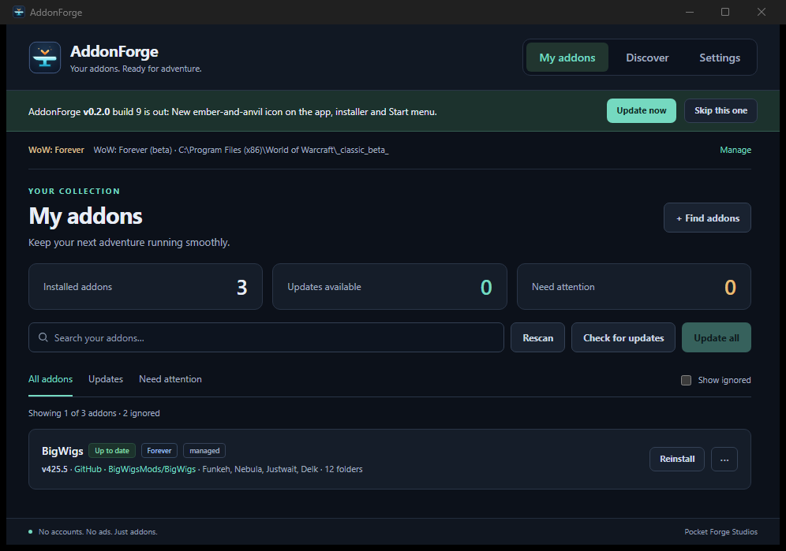

# AddonForge

A small, fast addon manager for **World of Warcraft: Forever**.

**[Download the latest release](https://github.com/Topher121/AddonForge/releases/latest)** for Windows 10/11. Two flavours, same app:

- `AddonForge-Setup-…exe`: installs to your user folder with a Start menu shortcut and an uninstaller. No admin rights needed.
- `AddonForge-v…exe`: portable, run it from anywhere, nothing installed.

Either one updates itself when a new build is out. Windows may show "Windows protected your PC" the first time because the files aren't code-signed yet: click *More info*, then *Run anyway*.



- **Light.** A single exe on top of the WebView2 that Windows already has. No bundled browser.
- **Private.** No account, no ads, no analytics, no server of ours in the loop. The app talks only to the sites addons are published on (GitHub, Wago, WoWInterface, TukUI), the same way your browser would.
- **Honest.** If an addon only publishes on CurseForge, AddonForge says so and gives you the link instead of pretending.

## How it finds addons

The app reads your `Interface\AddOns` folder and each addon's `.toc` file. Authors put their Wago / WoWInterface / CurseForge ids in there, and the BigWigs packager most authors use publishes a `release.json` with every GitHub release, so matching what you have to where it came from is mostly reading text files.

On top of that there is a **catalogue**: [`catalog/forever.json`](catalog/forever.json). It is a pointer list, not a host. Each entry says where the author publishes releases; downloads always come straight from there. Anyone can add an addon with a pull request.

## What it does

- Finds your WoW: Forever install and lists every addon in it, grouped properly (BigWigs and its twelve zone folders are one row).
- Checks for updates in parallel, straight from where each author publishes.
- Installs from the catalogue, or from **any GitHub repo** you paste in.
- Tells you when an addon is missing a required dependency, with a one-click install if the catalogue knows it.
- Pin an addon to hold it at its current version. Ignore one to hide it.
- Optional pre-release toggle for authors who only ship Forever builds as betas.
- Export your addon list to a small file, import it on another PC or send it to a friend.
- Refuses any zip that contains an executable. Addons are Lua, XML and media, nothing else.
- Updates itself: a banner appears when a new build is out, one click swaps the exe.
- "Report a problem" builds a diagnostics report you can read, then opens a GitHub issue or an email. Nothing leaves your PC until you press send.
- Keeps a small local log next to its settings file, never uploaded.

## Sources

| Source | Key needed? | Notes |
|---|---|---|
| GitHub releases | No | Preferred. Uses the packager's `release.json` when present. |
| Wago Addons | Your own free key | Paste it in Settings. Stored locally, only sent to addons.wago.io. |
| WoWInterface | No | Public JSON API. |
| TukUI | No | ElvUI / Tukui. |
| CurseForge | Link only | Their API terms don't allow a key to ship inside an app. |

## Build

Needs Rust (rustup), the MSVC build tools and Node.

```
npm install
npm run dev      # run with hot reload of the UI folder
npm run build    # portable exe in src-tauri/target/release/
```

The original ember-and-anvil app icon lives in `icon.svg`. Run
`powershell -File scripts/make-icons.ps1` after editing it to refresh the header
and packaged desktop icons, then rebuild the app. The Windows executable and
installer both embed `src-tauri/icons/icon.ico`.

## Contributing

Want an addon listed? See [CONTRIBUTING.md](CONTRIBUTING.md): one JSON entry and a pull request, validated automatically. Or open an "Add an addon" issue and we'll do it.

## Support

Bugs and ideas: use **Report a problem** in the app's Settings tab (it fills in the diagnostics), open an issue, or email PocketForgeStudios@proton.me.
If AddonForge saves you some hassle, [a tip on Ko-fi](https://ko-fi.com/pocketforgestudios) keeps the lights on. No pressure.

Made by Pocket Forge Studios. MIT licensed, see [LICENSE](LICENSE).

AddonForge is an independent project. It is not affiliated with, endorsed by or connected to CurseForge, Overwolf, Blizzard Entertainment, Wago, WoWInterface or TukUI. World of Warcraft is a trademark of Blizzard Entertainment.
